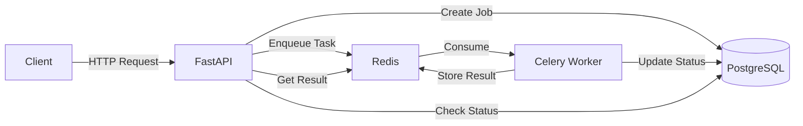

# Task Queue System Architecture

## Overview

The Task Queue System is a distributed application designed for reliable background job processing. It follows a producer-consumer pattern where API requests create jobs that are processed asynchronously by worker processes.

## System Components

### 1. API Layer (FastAPI)
- **Purpose**: Handles HTTP requests and responses
- **Key Features**:
  - RESTful endpoints for job management
  - Automatic API documentation (OpenAPI/Swagger)
  - Request validation and serialization
  - Dependency injection for services

### 2. Task Queue (Celery + Redis)
- **Purpose**: Manages distributed task execution
- **Components**:
  - **Celery**: Distributed task queue system
  - **Redis**: Message broker and result backend
- **Features**:
  - Asynchronous task execution
  - Task retries and error handling
  - Result tracking and storage
  - Rate limiting and prioritization

### 3. Data Layer (SQLAlchemy + PostgreSQL/SQLite)
- **Purpose**: Persistent data storage
- **Components**:
  - **SQLAlchemy ORM**: Database abstraction layer
  - **Alembic**: Database migrations
  - **PostgreSQL**: Primary database (production)
  - **SQLite**: Development and testing database

### 4. Worker Processes (Celery Workers)
- **Purpose**: Execute background tasks
- **Features**:
  - Horizontal scalability
  - Concurrency control
  - Task routing
  - Monitoring and management

## Data Flow

## Deployment Architecture

### Development
- Single container with SQLite
- Local Redis instance
- Single worker process

### Production
- Containerized microservices
- PostgreSQL database with replication
- Redis cluster for high availability
- Multiple Celery worker instances
- Load balancer for API instances
- Monitoring and logging stack

## Security Considerations

- API authentication (currently not implemented)
- Database connection pooling
- Secure Redis configuration
- Environment-based configuration
- Input validation and sanitization

## Performance Considerations

- Database connection pooling
- Task result TTL in Redis
- Worker concurrency settings
- Task timeouts and retry policies
- Caching strategies

## Monitoring and Operations

- Health check endpoints
- Prometheus metrics
- Structured logging
- Task monitoring via Flower (Celery monitoring tool)
- Error tracking and alerting

## Future Improvements

1. **Scalability**
   - Implement task prioritization
   - Add support for task batching
   - Introduce dead-letter queue for failed tasks

2. **Reliability**
   - Implement task deduplication
   - Add circuit breakers for external services
   - Implement rate limiting

3. **Observability**
   - Distributed tracing
   - Enhanced logging context
   - Performance metrics collection

4. **Features**
   - User authentication and authorization
   - Job scheduling
   - Webhook notifications
   - Task dependencies and workflows

## Technology Stack

- **API Framework**: FastAPI
- **Task Queue**: Celery
- **Message Broker**: Redis
- **Database**: PostgreSQL (production), SQLite (development)
- **ORM**: SQLAlchemy
- **Containerization**: Docker, Docker Compose
- **Testing**: Pytest, Pytest-cov
- **Documentation**: OpenAPI, ReDoc

## Dependencies

See `requirements.txt` for a complete list of Python dependencies.

## License

This project is licensed under the MIT License - see the [LICENSE](LICENSE) file for details.
